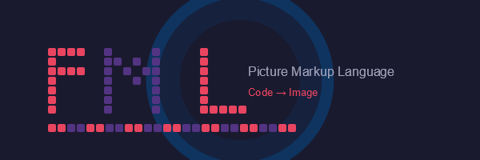
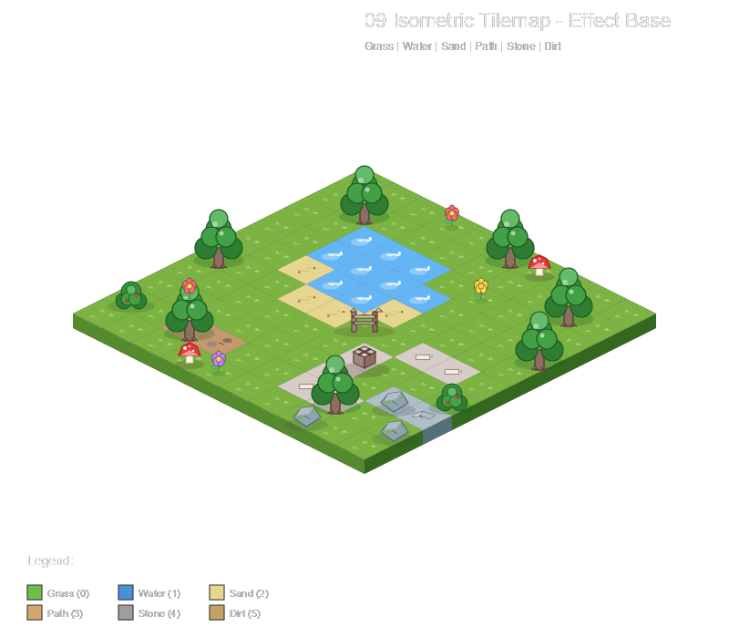
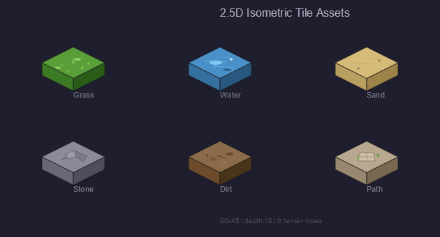
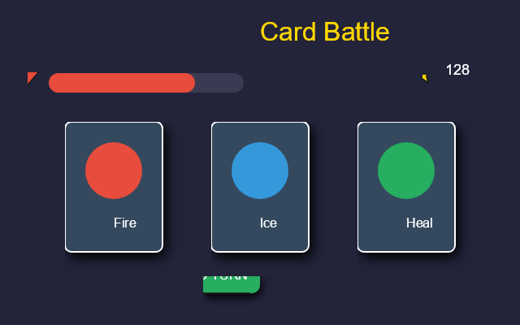
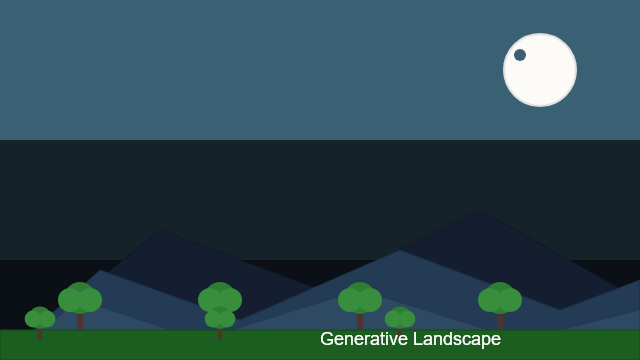
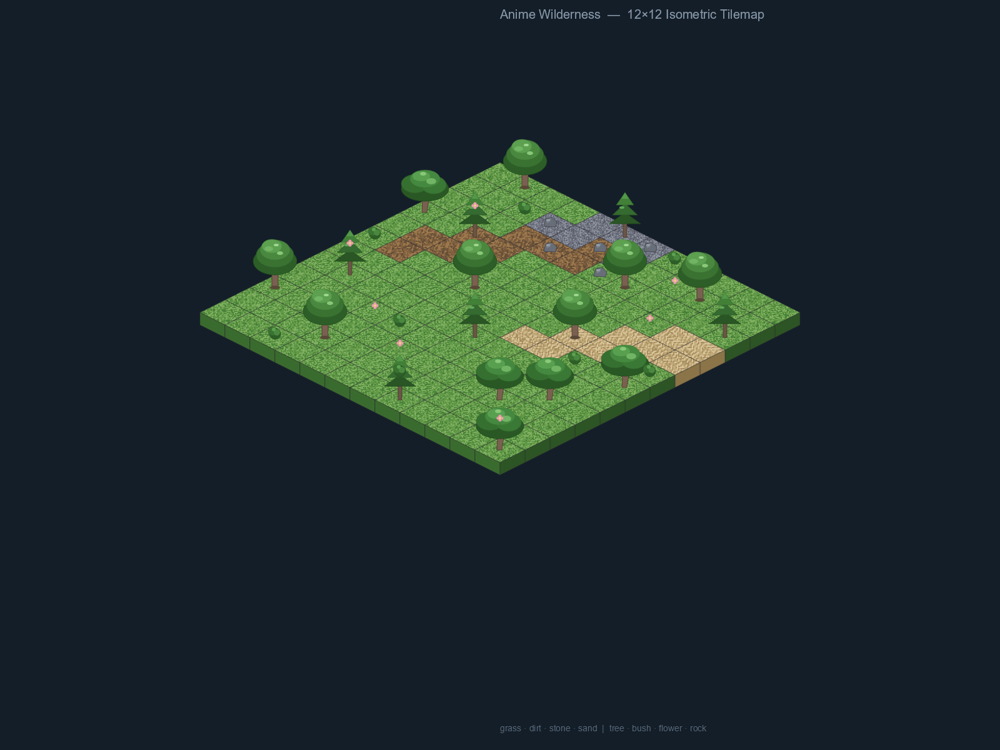
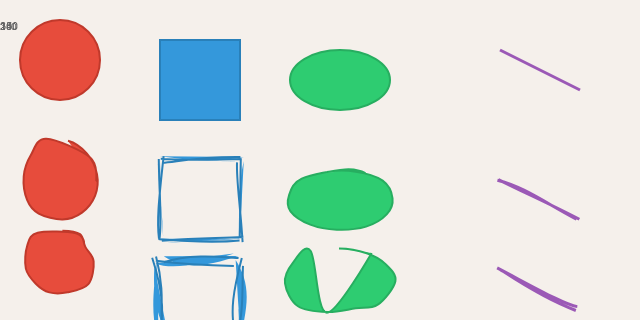

<div align="center">



# PML — Picture Markup Language

**Code is Image**

[](LICENSE)
[](https://en.cppreference.com/w/cpp/23)
[](https://skia.org/)

PML (Picture Markup Language) is an S-expression-based DSL for code-to-image generation.
Write PML scripts to create vector graphics, pixel art, UI mockups, game assets, animated GIFs, and even 3D scenes.

</div>

---

## Overview

PML combines the expressiveness of a programming language with a GPU-accelerated rendering engine. Use variables, functions, loops, and conditionals to describe graphics. Organize assets with modules. Achieve procedural generation with SkSL shaders.

```scheme
; hello.pml — your first PML image
(set-backend! "skia")
(canvas 400 300 :bg "#F8F9FA")

(add (circle 200 150 80
             :fill "#FF6B6B"
             :stroke "#C92A2A"
             :stroke-width 3))

(add (rect 150 100 100 80
           :fill "#51CF66"
           :rx 8))

(add (text 140 180 "Hello, PML!"
           :fill "#333"
           :font-size 20))

(render "hello.png")
```

---

## Feature Matrix

| Category | Capabilities |
|----------|-------------|
| **Shapes** | Circle, rect, ellipse, line, polygon, path, text, image |
| **Canvas** | Multiple canvases, sprite canvas, groups, transforms (translate/rotate/scale) |
| **Color & Style** | RGB/RGBA, gradients, fill/stroke, stroke alignment, opacity, blend modes |
| **Rough Style** | Hand-drawn rendering (Rough.js algorithm), noise fill, random seed |
| **Layer Composition** | Layers, groups, compositions, blend modes, drop-shadow/glow |
| **Filters** | Color adjust, curves, threshold, posterize, blur/sharpen, edge detect, convolution |
| **Shader** | SkSL shaders, multi-texture binding, fractal noise, domain warp |
| **3D Graphics** | Cube, sphere, cone, plane, 3D transforms, perspective/orthographic camera |
| **Animation** | Timeline, tweening, parallel/sequence, per-frame control |
| **Sprite Components** | Character (body/head/eyes/hair/outfit), UI (button/panel/health-bar), items, decorations |
| **Palette** | Predefined palettes, custom palettes, style definition & reference |
| **Tilemap** | Orthogonal & isometric tilemaps, tileset definition |
| **Bitmap Assets** | Image loading, spritesheet, bitmap layer, cropping |
| **Render Channels** | Albedo, normal, specular channel separation |
| **GIF Export** | Animated sequence export to GIF |
| **Module System** | File import, symbol export, circular dependency detection |

---

## Showcase


### 🏝️ Isometric Tilemap
Orthogonal and isometric tilemap rendering with multi-layer support and per-tile customization.

<div align="center">
  
  
</div>

---

### 🎮 Card Game UI
Building game UI elements: cards, panels, decorations, and text layout.

<div align="center">
  
</div>

---

### 🌄 Generative Landscape
SkSL shaders + fractal noise + domain warp combine to create unique terrain landscapes.

<div align="center">
  
</div>

---

### 🎨 Anime-Style Wilderness Scene
Multi-layer composition, custom shaders, noise textures, and isometric rendering in one scene.

```scheme
; Use apply-shader! to attach a shader to graphics
(define perlin (noise-fractal 200 200 :seed 42))
(define shader-handle (shader perlin :name "perlin"))

(define uniforms (make-uniforms "float time"))
(apply-uniforms shader-handle :time 0.5)

(add (rect 0 0 800 600 :fill "#fff"))
(apply-shader! shader-handle)
(render "wilderness.png")
```

<div align="center">
  
</div>

---

### ✏️ Rough / Hand-Drawn Style
Rough.js algorithm provides jittered strokes and hand-drawn textures.

```scheme
(add (circle 100 100 50
             :fill "#FF6B6B"
             :roughness 2
             :bowing 1
             :fill-weight 3))
```

<div align="center">
  
</div>

---

### 🎬 Animation
Timeline-driven tweening engine supporting parallel and sequential animation.

```scheme
(define a (animate circle-obj
                    :x 100 :y 100 :r 30
                    :duration 2
                    :ease "ease-in-out"))
(play a)
```

---

## Quick Start

### Build

```bash
# Clone
git clone https://github.com/wvfp/PML.git
cd PML

# Configure (CMake preset)
cmake --preset debug

# Build
cmake --build --preset debug

# Run tests
ctest --preset debug
```

**Dependencies**: Third-party libraries are fetched automatically via `FetchContent` (HTTPS) — no vcpkg required. Skia must be pre-built; point to it via `PML_SKIA_DIR` and `PML_SKIA_OUT`.

### Run

```bash
# Interactive REPL
./build/debug/src/pml/cli/Debug/pml.exe

# Execute a file
./build/debug/src/pml/cli/Debug/pml.exe hello.pml

# Specify output directory
./build/debug/src/pml/cli/Debug/pml.exe hello.pml -o ./output

# Watch mode (auto-re-render on file change)
./build/debug/src/pml/cli/Debug/pml.exe hello.pml --watch

# JSON output
./build/debug/src/pml/cli/Debug/pml.exe hello.pml --json
```

### VSCode Extension

Install the `pml-vscode` extension to get live preview for `.pml` files. Editing imported dependency files automatically triggers re-rendering of the main file.

---

## Project Structure

```
PML/
├── src/pml/           # C++23 core source
│   ├── core/          # Value system, error handling
│   ├── frontend/      # Lexer, parser, macro expander
│   ├── evaluator/     # Evaluator & builtin procedures
│   ├── graphics/      # Graphic objects & transforms
│   ├── graphics3d/    # 3D graphics
│   ├── backend/       # Render backends (Skia, GIF)
│   ├── animation/     # Animation timeline
│   ├── sprites/       # Sprite components & styles
│   ├── skeleton/      # Skeleton & IK
│   ├── layer/         # Layer composition
│   ├── filter/        # Image filters
│   ├── shader/        # SkSL shader support
│   ├── asset/         # Bitmap I/O
│   └── api/           # PMLRuntime unified interface
├── examples/          # Example scripts & outputs
├── docs/assets/       # Documentation resources
├── tests/             # Unit tests (630+ cases)
└── pml-vscode/        # VSCode extension
```

---

## License

MIT © wvfp

---

<div align="center">
  <sub>Logo rendered by PML itself | <a href="docs/assets/logo.pml">View source</a></sub>
</div>
