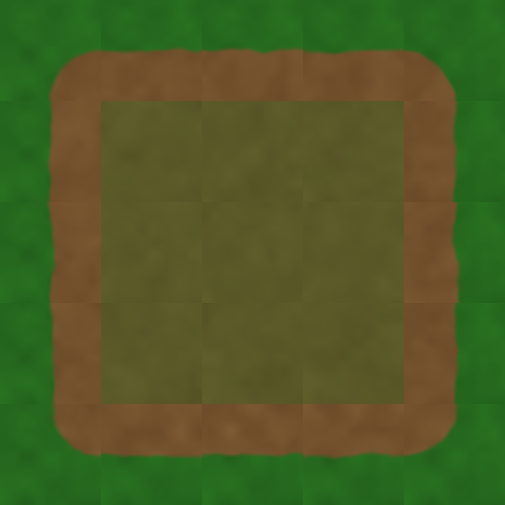
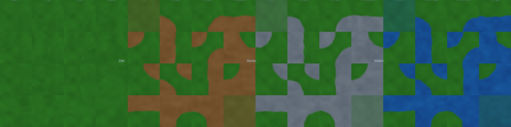

<div align="center">


# PML — 图片标记语言

**代码即图像**

[](https://github.com/wvfp/PML/releases/tag/v0.2.0)
[](LICENSE)
[](https://en.cppreference.com/w/cpp/23)
[](https://skia.org/)

PML（Picture Markup Language）是一种基于 S 表达式的领域特定语言，用代码描述图像。
编写 PML 脚本，即可生成矢量图、像素艺术、UI 界面、游戏素材、动画 GIF 乃至 3D 场景。

</div>

---

## 简介

PML 将编程语言的表达能力与图像渲染引擎结合。你可以用变量、函数、循环和条件语句来描述图形，用模块化组织素材，用 Shader 实现程序化生成。

```scheme
; hello.pml — 你的第一张 PML 图像
(set-backend! "skia")
(canvas 400 300 :bg "#F8F9FA")

(add (circle 200 150 80
             :fill "#FF6B6B"
             :stroke "#C92A2A"
             :stroke-width 3))

(add (rect 150 100 100 80
           :fill "#51CF66"
           :rx 8))

(add (text 140 180 "Hello, PML!"
           :fill "#333"
           :font-size 20))

(render "hello.png")
```

---

## 特性一览

| 类别 | 能力 |
|------|------|
| **图形绘制** | 圆形、矩形、椭圆、线条、多边形、路径、文字、图像 |
| **画布系统** | 多画布、Sprite 画布、分组、变换（平移/旋转/缩放） |
| **颜色与样式** | RGB/RGBA、渐变色（线性/径向/Sweep）、描边/填充、透明度、混合模式 |
| **风格化渲染** | 手绘风格（Rough.js 算法）、边缘扰动、随机种子 |
| **纹理映射** | UV 映射（平面/调和/显式）、透视校正、边缘混合 |
| **着色器系统** | SkSL 编译、分形噪声/湍流/Voronoi、域扭曲、色带量化、着色器内省与组合、uniform 动画 |
| **图层合成** | 图层、图层组、合成画布、混合模式、投影/发光/浮雕 |
| **滤镜系统** | 颜色调整、曲线、阈值、马赛克、模糊/锐化、边缘检测、卷积 |
| **3D 图形** | 立方体、球体、圆锥、平面、3D 变换、透视/正交相机 |
| **动画** | 时间线、补间、并行动画、序列动画、uniform 动画、逐帧控制 |
| **精灵组件** | 角色（身体/头部/眼睛/头发/服装）、UI（按钮/面板/血条）、物品、场景装饰 |
| **调色板** | 预置调色板、自定义调色板、风格定义与引用 |
| **瓦片地图** | 正交/等距瓦片地图、Dual-Grid 地形（SDF 过渡） |
| **位图资产** | 图片加载、精灵表单、位图图层、裁剪 |
| **渲染通道** | 多通道图像（albedo/specular/normal）、裁剪路径 |
| **GIF 导出** | 动画序列导出为 GIF |
| **模块系统** | 文件导入、符号导出、`&optional`/`&key`/`&rest` 参数语法 |
| **VSCode 扩展** | 语法高亮、代码补全、实时预览、依赖追踪、渲染历史 |

---

## 示例展示

### 🏝️ Dual-Grid 地形瓦片
Dual-Grid 地形系统，SDF 平滑过渡。

<div align="center">
  
  
</div>

---

### 🏝️ 等距瓦片地图
正交与等距两种瓦片地图渲染，支持多层地图和独立瓦片设置。

<div align="center">
  
  
</div>

---

### 🎮 卡牌游戏 UI
用 PML 构建游戏界面元素：卡片、面板、装饰与文字排版。

<div align="center">
  
</div>

---

### 🌄 程序化生成风景
Shader 着色器 + 分形噪声 + 域扭曲，生成独特的地形景观。

<div align="center">
  
</div>

---

### 🎨 动漫风格野外场景
多层合成、自定义 Shader、噪声纹理与等距结合的完整场景。

```scheme
;; 着色器内省 — 在运行时检查 uniform 声明
(define s (noise-fractal :seed 42 :octaves 4))
(println (shader-uniforms s))
;; → ((u_freq_x float2 0 8) (u_seed float 16 4) ...)

;; 着色器组合 — GPU 端管线
(define tonemapped (compose-with-child "
  uniform shader child;
  half4 main(float2 xy) {
    half4 c = child.eval(xy);
    return half4(c.r * 0.5, c.g * 0.8, c.b * 1.2, 1);
  }
" (noise-fractal :seed 42)))
(add (apply-shader! (rect 0 0 400 400) tonemapped))
```

<div align="center">
  
</div>

---

### ✏️ 手绘风格
Rough.js 算法实现的手绘效果：抖动描边、填充纹理。

```scheme
(add (circle 100 100 50
             :fill "#FF6B6B"
             :roughness 2
             :bowing 1
             :seed 42))
```

<div align="center">
  
</div>

---

### 🎬 动画
时间线驱动的补间动画 + 着色器 uniform 动画。

```scheme
;; 对象属性动画
(let ((ball (circle 150 50 30 :fill "#e94560")))
  (add ball)
  (animate ball "y" 50 250 1.0 :ease "ease-in-out"))

;; 着色器 uniform 动画 — 随时间自动插值
(define s (noise-fractal :seed 1 :octaves 4))
(uniform-animate s "u_freq_x" 0.005 0.05 2.0 :ease "ease-in-out")
```

---

## 快速开始

### 下载预编译版本

从 [Releases](https://github.com/wvfp/PML/releases) 下载 `pml-v0.2.0-win64.exe`，或自行构建：

```bash
# 克隆
git clone https://github.com/wvfp/PML.git
cd PML

# 配置（CMake 预设）
cmake --preset debug

# 构建
cmake --build --preset debug

# 运行测试（326 单元测试 + 321 冒烟测试）
ctest --preset debug
```

**依赖说明**：第三方库通过 `FetchContent` 自动拉取，无需 vcpkg。Skia 需预编译，路径在 `CMakePresets.json` 中配置。

### 运行

```bash
# 执行文件
./build/debug/src/pml/cli/Debug/pml.exe hello.pml

# REPL 交互模式
./build/debug/src/pml/cli/Debug/pml.exe

# 监听文件变更自动重渲染
./build/debug/src/pml/cli/Debug/pml.exe hello.pml --watch

# JSON 输出模式
./build/debug/src/pml/cli/Debug/pml.exe hello.pml --json
```

### VSCode 扩展

安装 `pml-vscode-0.1.0.vsix` 后，`.pml` 文件自动获得语法高亮、代码补全和实时预览。

---

## 项目结构

```
PML/
├── src/pml/              # C++23 核心源码
│   ├── core/             # 值系统（Value/Arena）、错误处理
│   ├── frontend/         # 词法、语法、宏展开
│   ├── evaluator/        # 求值器与内置函数（shader、clip、name 等）
│   ├── graphics/         # 图形对象、变换、纹理管线、UV 求解
│   ├── graphics3d/       # 3D 图形
│   ├── backend/          # 渲染后端抽象 + Skia/GIF/Null 实现
│   ├── animation/        # 动画时间线
│   ├── sprites/          # 精灵组件与样式
│   ├── skeleton/         # 骨骼与 IK
│   ├── layer/            # 图层合成
│   ├── filter/           # 图像滤镜
│   ├── asset/            # 位图 I/O
│   └── api/              # PMLRuntime 统一接口 + 纹理缓存
├── examples/             # 示例脚本与输出
├── docs/                 # 文档与计划
├── tests/                # 单元测试（326 + 321 冒烟测试）
├── pml-vscode/           # VSCode 扩展
└── stdlib/               # PML 标准库
```

---

## 快速参考

### 图形基元

| 函数 | 说明 |
|------|------|
| `(circle cx cy r)` | 圆 |
| `(rect x y w h [:rx])` | 矩形（可选圆角） |
| `(ellipse cx cy rx ry)` | 椭圆 |
| `(polygon points ...)` | 多边形（含边缘扰动） |
| `(path :d "SVG路径")` | SVG 路径 |
| `(text x y content)` | 文字 |
| `(group children...)` | 分组 |

### 着色器

| 函数 | 说明 |
|------|------|
| `(shader src)` | 编译 SkSL |
| `(apply-shader! go handle [:coordinate-space])` | 应用着色器到图形 |
| `(shader-uniforms handle)` | 内省 uniform 声明 |
| `(shader-children handle)` | 内省 child shader 插槽 |
| `(eval-shader handle x y)` | 采样着色器 |
| `(compose-with-child sksl child ...)` | GPU 端着色器组合 |
| `(uniform-animate handle name from to dur)` | uniform 动画 |

### 纹理

| 函数 | 说明 |
|------|------|
| `(define-texture name (w h) ...)` | 定义纹理 |
| `(texture-map shape :source tex ...)` | 纹理映射（平面/调和/显式 UV） |

### 动画

| 函数 | 说明 |
|------|------|
| `(animate target prop from to dur)` | 补间动画 |
| `(parallel anims...)` | 并行动画 |
| `(sequence anims...)` | 序列动画 |
| `(uniform-animate handle name from to dur)` | 着色器 uniform 动画 |

---

## 许可证

MIT © wvfp

---

<div align="center">
  <sub>使用 PML 自身渲染的 Logo | <a href="docs/assets/logo.pml">查看源码</a></sub>
</div>

</div>
